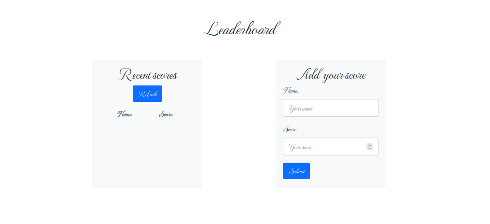

# Leaderboard

> This is my website for a Leaderboard

## Built With

- HTML & CSS & JS & WEBPACK

## Project Setup

- Clone this repository
- Open the folder project (to-do-list)
- Install all dependencies with "npm install"
- Run the project with "npm start" and the project will load automatically in your default browser

## Authors

👤 **Ricardo**

- GitHub: [@Richie9000](https://github.com/Richie9000)
- Twitter: [@R1ck1987](https://twitter.com/R1ck1987")

## 🤝 Contributing

Contributions, issues, and feature requests are welcome!

## Show your support

Give a ⭐️ if you like this project
